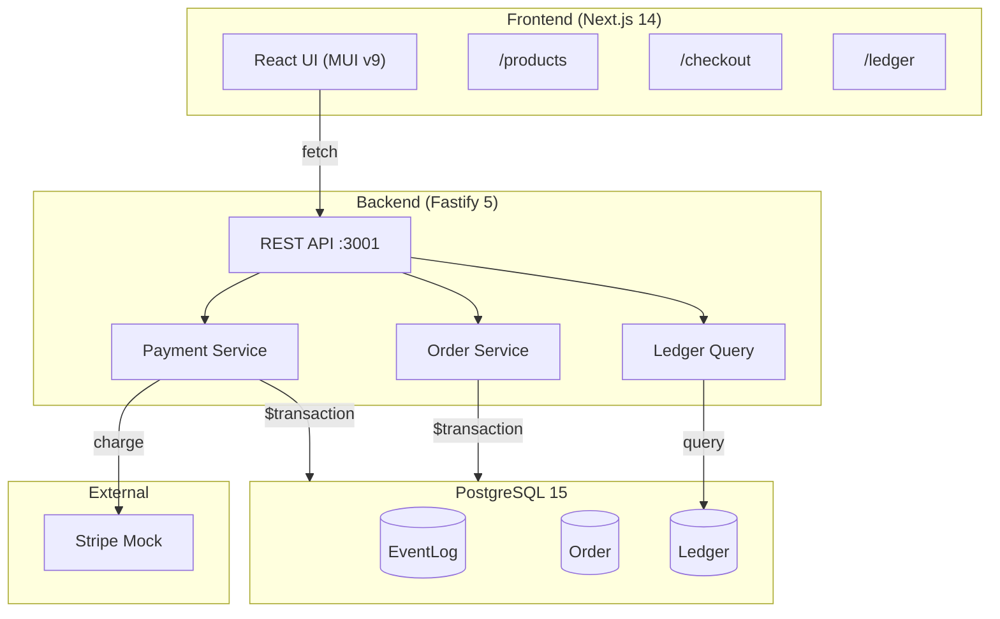

# Entropi E-Commerce

A financial-grade e-commerce platform with event-sourced order management, double-entry ledger bookkeeping, and Stripe payment integration.

## Architecture



## Quick Start

### Prerequisites

- Node.js 18+
- Docker & Docker Compose
- npm

### Setup

```bash
# 1. Clone and install
git clone <repo-url>
cd entropi_ecommerce
npm install

# 2. Start database & backend (Docker)
docker-compose up -d

# 3. Run Prisma migrations
npx prisma db push

# 4. Start the frontend
npm run dev

# 5. Start the backend (if not using Docker)
npx tsx src/server/index.ts
```

### Services

| Service | URL | Description |
|---------|-----|-------------|
| Frontend | http://localhost:3000 | Next.js storefront |
| Backend API | http://localhost:3001 | Fastify REST API |
| PostgreSQL | localhost:5432 | Database |

## API Endpoints

| Method | Endpoint | Body | Description |
|--------|---------|------|-------------|
| `POST` | `/api/orders` | `{ id, amount, idempotencyKey }` | Create a new order |
| `POST` | `/api/orders/:id/pay` | `{ amount, idempotencyKey, stripeId }` | Process payment |
| `GET` | `/api/ledger` | — | Retrieve all ledger entries |

## Ledger Design

Every financial operation records equal debit and credit entries (double-entry bookkeeping):

```
Order Created ($100):          Payment Confirmed ($100):       Fee Calculated (3%):
┌─────────────────┬───────┐   ┌─────────────────┬───────┐    ┌─────────────────┬───────┐
│ order_balance DR │$100   │   │ payment      DR │$100   │    │ fees         DR │$3.00  │
│ payment      CR │$100   │   │ order_balance CR │$100   │    │ payment      CR │$3.00  │
└─────────────────┴───────┘   └─────────────────┴───────┘    └─────────────────┴───────┘
```

**Invariant**: `SUM(debits) == SUM(credits)` — always, for every order.

## Concurrency Strategy

Three-layer defense against race conditions:

1. **Idempotency Keys** — Duplicate requests return cached results (`idempotencyKey @unique`)
2. **State Machine** — Invalid transitions rejected (e.g., paying an already-paid order)
3. **Optimistic Concurrency** — Version field on `Order` prevents lost updates (`WHERE version = ?`)

Payment processing uses a **split transaction** pattern to avoid holding DB connections during external Stripe calls.

## Testing

```bash
# Run all tests (9 functional + 1 stress test)
npm test
```

### Test Cases

| # | Test | What it validates |
|---|------|------------------|
| 1 | Happy Path | Order creation → payment flow |
| 2 | Idempotency | Duplicate requests return same result |
| 3 | Ledger Balance | SUM(debits) = SUM(credits) |
| 4 | Decimal Precision | 3% of $1.00 = $0.03 exactly |
| 5 | Concurrent Orders | 100 concurrent payments, no corruption |
| 6 | Settlement Idempotency | Placeholder for future settlement |
| 7 | Version Conflict | 5 simultaneous pays → 1 success, 4 rejected |
| 8 | Invalid Transition | Paying already-paid order → 500 |
| 9 | Projection Consistency | Order.version == EventLog count |
| 10 | **Stress Test** | 1,000 orders + payments, ≥95% success rate |

### Stress Test Results

```
Total orders:         1,000
Success rate:         100.0%
Throughput:           ~834 ops/sec
Server post-test:     Stable ✅
```

## Documentation

| Document | Description |
|----------|-------------|
| [Architecture](docs/ARCHITECTURE.md) | System diagram, data flow, tech stack |
| [Concurrency](docs/CONCURRENCY.md) | Idempotency, OCC, split transactions |
| [Financial Rules](docs/FINANCIAL_RULES.md) | Ledger design, decimal precision, invariants |

## Tech Stack

| Layer | Technology |
|-------|-----------|
| Frontend | Next.js 14, React 18, MUI v9 |
| Backend | Fastify 5 |
| Database | PostgreSQL 15, Prisma 5 |
| Precision | decimal.js, DECIMAL(18,4) |
| Testing | Jest 30, ts-jest |
| Containers | Docker Compose |

## License

See [LICENSE](LICENSE) for details.
