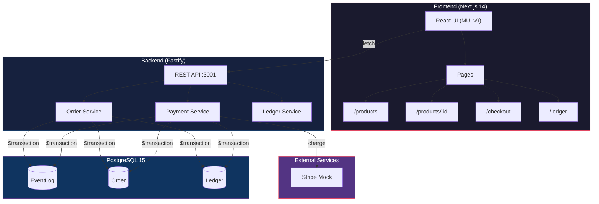
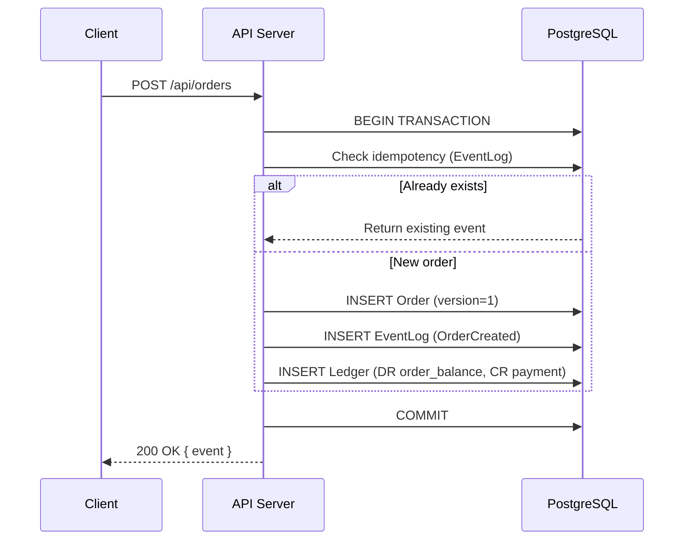
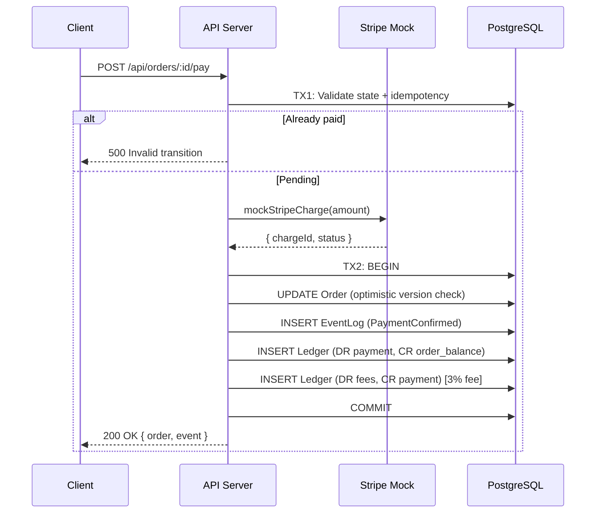
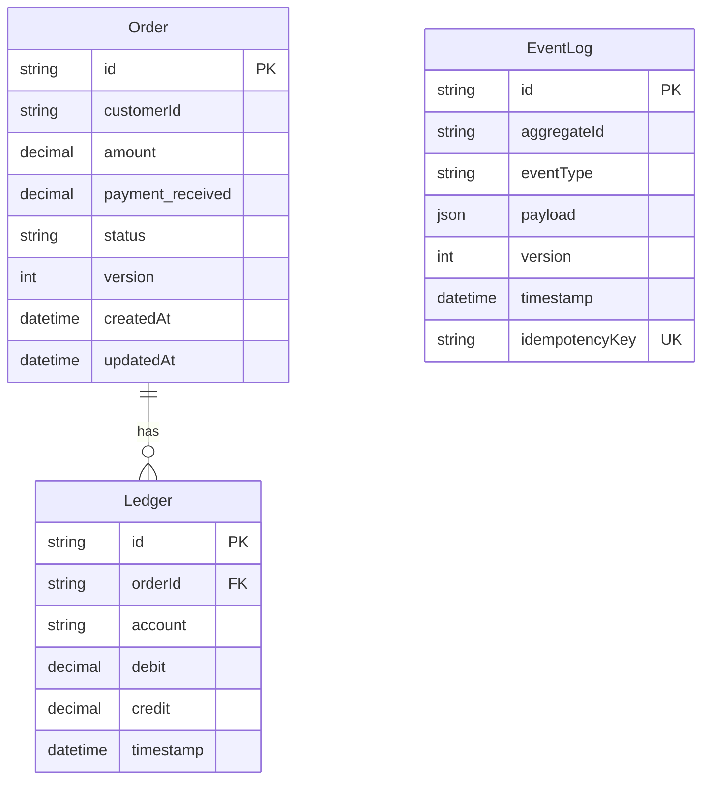

# Architecture Overview

## System Diagram



## Tech Stack

| Layer | Technology | Purpose |
|-------|-----------|--------|
| Frontend | Next.js 14 + React 18 | SSR/CSR pages |
| UI Library | MUI v9 + Emotion | Component system |
| Backend | Fastify 5 | REST API server |
| ORM | Prisma 5 | Type-safe DB access |
| Database | PostgreSQL 15 | Persistent storage |
| Precision | decimal.js | Financial math |
| Payments | Stripe Mock | Simulated charges |
| Container | Docker Compose | Local orchestration |
| Tests | Jest 30 + ts-jest | Automated testing |

## Project Structure

```
entropi_ecommerce/
├── src/
│   ├── app/                    # Next.js App Router
│   │   ├── layout.tsx          # Root layout with MUI theme
│   │   ├── page.tsx            # Home / product listing
│   │   ├── products/[id]/      # Product detail page
│   │   ├── checkout/           # Checkout flow
│   │   └── ledger/             # Ledger audit trail
│   ├── components/             # Shared React components
│   │   └── Navigation.tsx      # Bottom nav bar
│   ├── context/                # React context providers
│   ├── data/                   # Static product data
│   ├── server/
│   │   └── index.ts            # Fastify backend (port 3001)
│   └── theme.ts                # MUI theme config
├── prisma/
│   └── schema.prisma           # Database schema
├── tests/
│   └── backend.test.ts         # 10 test cases
├── docker-compose.yml          # PostgreSQL + Backend
└── package.json
```

## Data Flow

### Order Creation



### Payment Processing



## API Endpoints

| Method | Endpoint | Description |
|--------|---------|-------------|
| `POST` | `/api/orders` | Create a new order |
| `POST` | `/api/orders/:id/pay` | Process payment for an order |
| `GET` | `/api/ledger` | Retrieve all ledger entries |

## Database Schema


