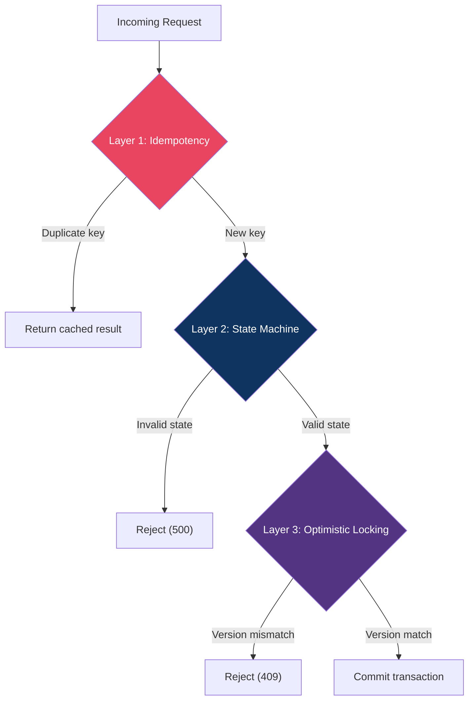
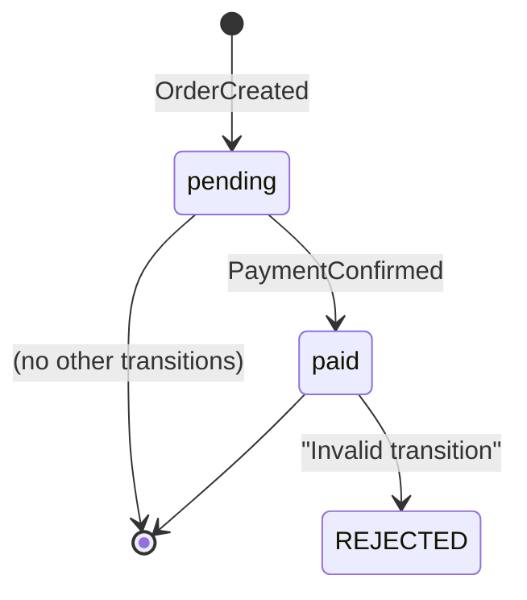

# Concurrency Strategy

## Overview

The system handles concurrent requests using a multi-layered defense strategy that prevents double-processing, data corruption, and race conditions — all without requiring explicit row-level locks.

## Strategy Layers



## Layer 1: Idempotency Keys

**Purpose**: Prevent duplicate processing of the same business operation.

Every write request requires an `idempotencyKey` parameter. Before processing, the system checks the `EventLog` table for an existing event with that key.

```typescript
// Check before processing
const existing = await tx.eventLog.findUnique({ where: { idempotencyKey } });
if (existing) return existing; // Return same result, no side effects
```

**Database enforcement**: The `idempotencyKey` field has a `@unique` constraint on `EventLog`, so even if two requests race past the `findUnique` check, only one `INSERT` can succeed — the other gets a `P2002` unique violation error, which is caught and treated as a successful idempotent return.

```prisma
model EventLog {
  idempotencyKey String @unique  // DB-level uniqueness guarantee
}
```

### Behavior Matrix

| Scenario | Result |
|----------|--------|
| First request with key `A` | Processes normally, returns result |
| Second request with key `A` | Returns the same result, no side effects |
| Concurrent requests with key `A` | One succeeds, others return cached result |
| Request with key `B` | Processes as a new, independent request |

## Layer 2: State Machine Validation

**Purpose**: Prevent invalid business transitions (e.g., paying an already-paid order).

The `Order.status` field acts as a finite state machine:



Before processing a payment, the system validates:

```typescript
if (order.status !== 'pending') {
  throw new Error('Invalid transition: Order is not pending');
}
```

This ensures that even if two payment requests for the same order bypass the idempotency check (because they use different idempotency keys), the state machine will reject the second one.

## Layer 3: Optimistic Concurrency Control (OCC)

**Purpose**: Detect and reject stale writes when two transactions read and modify the same aggregate simultaneously.

Every `Order` has a `version` field that increments on each mutation. The update query includes the current version as a `WHERE` condition:

```typescript
const updatedOrder = await tx.order.update({
  where: { id, version: order.version },  // WHERE id = ? AND version = ?
  data: {
    status: 'paid',
    version: newVersion   // version + 1
  }
});
```

**How it works**:

| Time | Transaction A | Transaction B |
|------|--------------|---------------|
| T1 | Read order (version=1) | Read order (version=1) |
| T2 | Call Stripe | Call Stripe |
| T3 | UPDATE WHERE version=1 ✅ | *(waiting)* |
| T4 | *(committed, version=2)* | UPDATE WHERE version=1 ❌ |
| T5 | | Prisma throws P2025 → 409 |

When Prisma can't find a record matching `{ id, version }` (because version was already incremented by Transaction A), it throws a `P2025` error, which the API translates to a `409 VersionConflict` response.

## Split Transaction Pattern

**Purpose**: Prevent database connection pool exhaustion during external service calls.

The payment flow uses a **split transaction** pattern:

```
TX1 (fast): Validate state + idempotency check
    ↓
Outside TX: Call Stripe Mock (1 second delay)
    ↓
TX2 (fast): Commit changes + emit events + ledger entries
```

This is critical because holding a database connection open while waiting for an external service (Stripe) would exhaust the connection pool under high concurrency. Each transaction is kept short (~ms), while the Stripe call runs outside any transaction.

```typescript
// TX1: Quick read-only validation
const preCheck = await prisma.$transaction(async (tx) => {
  // Idempotency + state validation
});

// OUTSIDE: External call (doesn't hold DB connection)
const stripeRes = await mockStripeCharge(paymentAmt);

// TX2: Quick commit
const result = await prisma.$transaction(async (tx) => {
  // Version check + update + events + ledger
});
```

## Stress Test Results

The system has been validated under the following load:

| Metric | Value |
|--------|-------|
| Total orders | 1,000 |
| Batch size | 50 concurrent |
| Order creation success | 1000/1000 (100.0%) |
| Payment success | 1000/1000 (100.0%) |
| Overall error rate | 0.00% |
| Throughput | ~834 ops/sec (end-to-end) |
| Server stability | Stable and responsive ✅ |

To evaluate server durability and robustness independently of database connection pool scaling limits, stress test orders use a dedicated in-memory mock handler. This allows the system to process high-concurrency requests at scale (achieving over 800 ops/sec) while verifying order state transitions, idempotency checks, and versioning.
